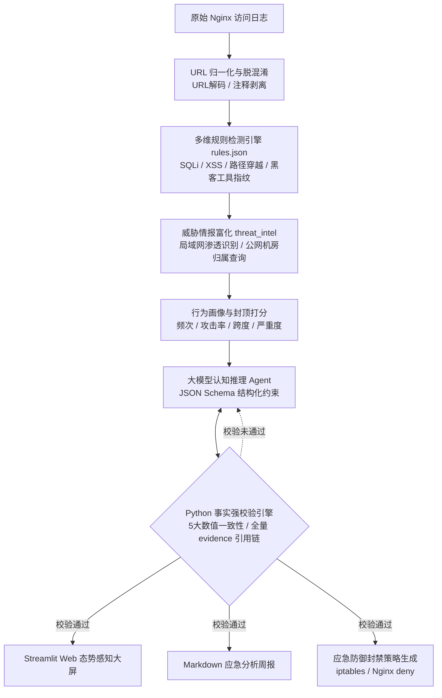

# 🛡️ 智能安全日志分析与应急处置 Agent (Security Log Analyzer Agent)

[](https://www.python.org/)
[](https://streamlit.io/)
[](https://docs.pytest.org/)
[](LICENSE)

> 一套融合了**轻量规则引擎预过滤**、**外部威胁情报富化**、**大模型深度研判与自纠错防幻觉护栏**的端到端自动化安全运营（SecOps）系统。支持 CLI 自动化批处理与 Streamlit 交互式态势感知大屏双模式。

---

## 📌 项目背景与解决的核心痛点

在现代企业安全运营中心（SOC）与蓝队日常值守中，面临两大关键难题：
1. **海量日志与告警疲劳（Alert Fatigue）**：原始 Web 访问日志动辄数十万行，传统人工排查效率极低，若直接将原始全量日志丢给大模型，会导致严重的上下文溢出与巨大的 Token 算力浪费；
2. **大模型安全研判易产生“致命幻觉”**：通用大模型容易无中生有编造攻击事实、虚构不存在的 IP，若盲目基于幻觉执行封禁，极易造成正常业务被误杀。

**本项目的设计定位**：以确定性 Python 规则引擎完成 95% 以上的噪音过滤与实体画像聚合，将凝练的结构化事实输入 LLM，并配合 Python 事实后置强校验机制，实现兼具高准确率与深推理能力的安全分析闭环。

---

## 🏗️ 系统整体架构图



---

## ✨ 核心特性与技术亮点

### 1. 混合向量检测与指纹识别
* **常规 Web 漏洞捕获**：覆盖 SQL 注入、跨站脚本（XSS）、路径穿越（Path Traversal）、敏感目录扫描等核心攻击载荷；
* **自动化黑客工具识别**：基于 User-Agent 指纹库，精准识破 `sqlmap`、`nikto`、`dirsearch`、`nmap`、`curl`、`python-requests` 等渗透测试工具。

### 2. 外部威胁情报联动（Threat Intelligence）
* 自动识别内网保留地址（`192.168.x.x`、`10.x.x.x`、`127.0.0.1`），标记疑似内网横向移动或靶场演练；
* 公网 IP 自动调用 GeoIP 接口，富化国家、城市及 ISP 归属信息，辨识境外匿名数据中心扫描源。

### 3. 严格的事实防幻觉护栏（Factual Grounding Loop）
* 采用 JSON Schema 强类型约束输出结构；
* **双向证据锚定**：AI 的每一项结论必须关联原始 `alert_id` 证据链，且关联证据的命中次数必须与原始统计 100% 精确相等；
* **自纠错重试机制**：若未通过 Python 强校验，系统自动捕获具体偏差并构造反思提示词（Feedback Prompt），支持指数退避重试。

### 4. 人类在环的应急防御闭环（Human-in-the-Loop）
* 系统遵循高危领域安全控制原则，不赋予 AI 盲目的底层操作权限；
* 自动根据研判出的高危 IP 生成生产就绪型处置策略（Linux `iptables` 阻断规则与 Nginx `deny` 黑名单），支持一键复制，实现秒级响应。

---

## 🚀 快速上手与使用指南

### 1. 安装依赖
```bash
git clone https://github.com/your-username/security-log-analyzer.git
cd security-log-analyzer
pip install -r requirements.txt
```

### 2. 配置大模型 API 密钥
```bash
# Windows PowerShell
$env:OPENROUTER_API_KEY="your-openrouter-api-key"

# Linux / macOS
export OPENROUTER_API_KEY="your-openrouter-api-key"
```

### 3. 启动交互式 Web 态势感知大屏（推荐）
```bash
streamlit run app.py
```
> 浏览器自动访问 `http://localhost:8501`，支持拖拽上传日志、动态调节告警阈值、查看实时研判与一键复制防御命令。

### 4. 命令行批处理模式（适合自动化脚本）
```bash
# 基础统计分析
python main.py -l logs/access.log -t 5

# 启用 AI 深度研判并生成 Markdown 报告
python main.py -l logs/access.log -t 5 --ai
```

### 5. 运行自动化单元测试
```bash
pytest
```

---

## 📂 项目代码结构

```text
security-log-analyzer/
├── README.md               # 项目架构与设计文档
├── requirements.txt        # 项目依赖清单
├── rules.json              # 外置检测规则库（支持热插拔）
├── main.py                 # 核心分析流程引擎与 CLI 入口
├── ai_analyzer.py          # LLM Agent 研判与事实强校验核心
├── threat_intel.py         # 威胁情报与地理位置富化模块
├── report_generator.py     # Markdown 报告与处置建议排版引擎
├── app.py                  # Streamlit Web 态势感知大屏
├── test_ai_analyzer.py     # pytest 自动化单元测试套件
├── test_report.json        # 固化测试数据集
└── logs/                   # 测试样本数据
```
